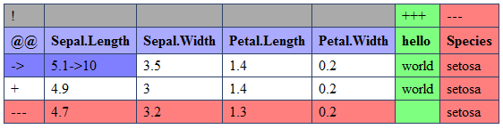

<!-- README.md is generated from README.Rmd. Please edit that file -->

```{r, include = FALSE}
knitr::opts_chunk$set(
  collapse = TRUE,
  comment = "#>",
  fig.path = "man/figures/README-",
  out.width = "100%"
)
```

<!-- badges: start -->


[](https://github.com/edwindj/daff/actions/workflows/R-CMD-check.yaml)


<!-- badges: end -->

# Daff: diff, patch and merge for data.frames

daff is an R package that can find difference in values between
`data.frames`, store this difference, render it and apply this
difference to patch a `data.frame`. It can also merge two versions of a
`data.frame` having a common parent. It wraps the
[daff.js](http://paulfitz.github.io/daff/) library using the
[V8](https://github.com/jeroen/v8) package.

The diff format is described in
<https://paulfitz.github.io/daff-doc/spec.html>.


Functions:

- diff: `diff_data`
- patch: `patch_data`
- write/read diff: `read_diff` and `write_diff`
- render to html: `render_diff`
- merge two tables based on a same version: `merge_data`


## Installation

You can install the development version of daff from [GitHub](https://github.com/) with:

``` r
# install.packages("devtools")
devtools::install_github("edwindj/daff")
```

# Usage

## diff_data

Calculate the difference between a reference and a changed `data.frame`

``` r
library(daff)
y <- iris[1:3,]
x <- y

x <- head(x,2) # remove a row
x[1,1] <- 10 # change a value
x$hello <- "world"  # add a column
x$Species <- NULL # remove a column

patch <- diff_data(y, x)

# write a patch to disk
write_diff(patch, "patch.csv")
```

`render_diff(patch)` will generate the following HTML page:

<figure>

<figcaption aria-hidden="true">render_diff</figcaption>
</figure>

## patch_data

Patch a `data.frame` using a diff generated with `diff_data`.

``` r
# read a diff from disk
patch <- read_diff("patch.csv")

# apply patch
y_patched <- patch_data(y, patch)
```

## merge_data

Merge two `data.frame`s that have diverged from a common parent
`data.frame`.

``` r
parent <- a <- b <- iris[1:3,]
a[1,1] <- 10
b[2,1] <- 11
# succesful merge
merge_data(parent, a, b)

parent <- a <- b <- iris[1:3,]
a[1,1] <- 10
b[1,1] <- 11
# conflicting merge (both a and b change same cell)
merged <- merge_data(parent, a, b)
merged #note the conflict

#find out which rows contain a conflict
which_conflicts(merged)
```
